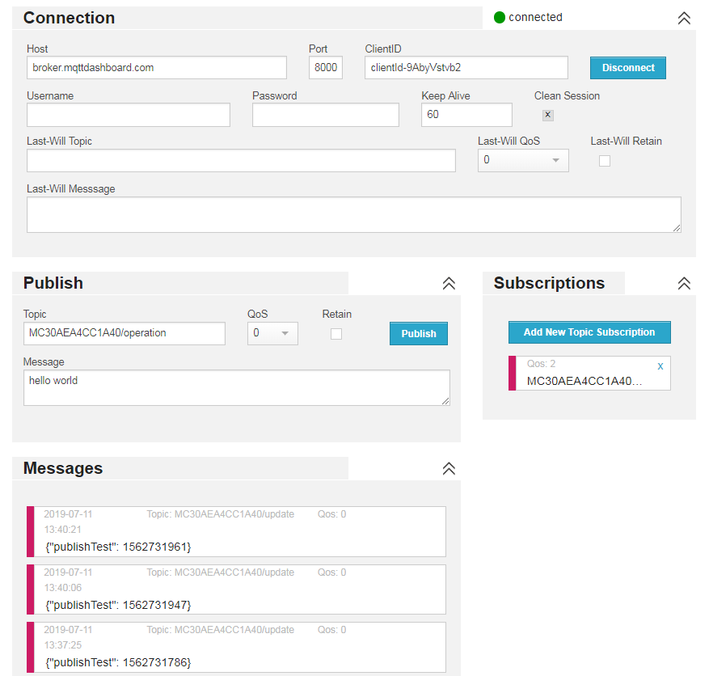

# MQTT Example

This is a minimum MQTT example.


## Procedures Explain

- Connect to MQTT sever and subscribe a topic
- Task ``taskPublishTest`` will publish a mqtt message every 10 seconds

## Run and Test

### Using Website as A Peer Client

- Open: http://www.hivemq.com/demos/websocket-client/
- Hit [ Connect ]
- Click [ Add New Topic Subscription ]
- Set the subscription topic to ``MC30AEA4CC1A40/update``
- Modify the [ Publish ] topic to ``MC30AEA4CC1A40/operation``



### Run the plug-in on the Hub or simulator

- Upload ``__init__.py`` to Hub's or simulator's ``/app`` folder
- Run the code

### Test

#### From the Remote Peer to the Hub

- On web client (remote peer), input any message to [ Message ] field, then hit [ Publish ]
- You will see this line appears in the console output:

```
MQTT: received: topic[MC30AEA4CC1A40/operation] msg[hello world]
```

#### From the Hub to the Remote Peer

- The Hub will publish a message every 10 seconds
- You will see the messages appear on the web client's [ Messages ]

